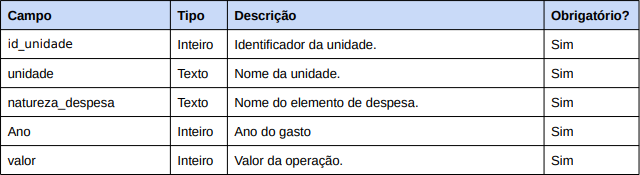
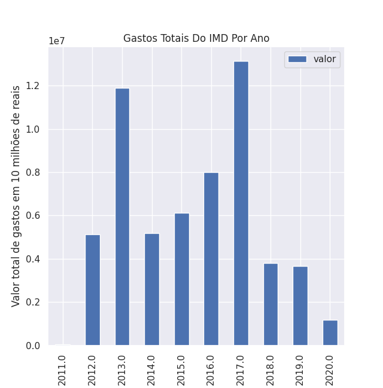
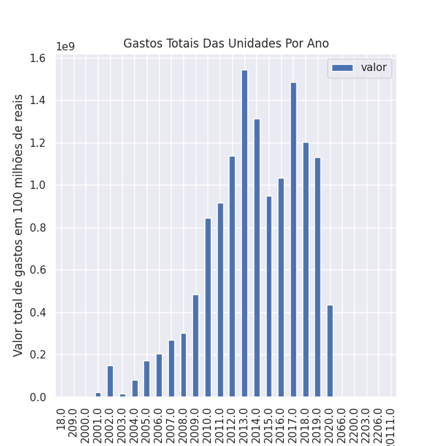

# Introdução

Projeto realizado para contabilização de presença na disciplina de probabilidade durante o período de 2020.5 no Instituto Metrópole Digital.

## Base de Dados

A base de dados escolhida foi a Relação de gastos por unidades da UFRN disponível no site dados.gov.br, foi usado o documento csv disponibilizado no endereço: [link para base](http://www.dados.gov.br/dataset/gastos). Tal arquivo contém os seguintes campos:


## Introdução à Base de Dados

A base de dados representa os gastos por unidade da UFRN desde o ano de 2000 até o ano de 2020. 

As variáveis da base são: **id_unidade**, que corresponde ao número identificador da unidade e que é uma variável qualitativa nominal; **unidade**, que corresponde ao nome da unidade que realizou o gasto e pode ser classificada como uma variável qualitativa nominal; **natureza_despesa**, que classifica a motivação do gasto e é uma variável qualitativa nominal; **Ano**, que marca qual o ano da movimentação financeira e pode ser classificada como quantitativa discreta e **valor** que apresenta o valor exato do gasto da movimentação.

As unidades amostrais da base são as unidades da universidade, porém para facilitação de observação dos dados e considerando o provável elevado tamanho da base de dados analisaremos, primeiramente, somente os dados do Instituto Metrópole Digital.

Como o IMD só foi fundado em 2011 esperamos que só tenhamos dados a partir dessa data. Ademais, esperamos que no ano de 2020 os dados apresentem uma considerável diminuição em consequência da pandemia que ocasionou uma suspensão nas atividades do instituto.

Posteriormente analisaremos os gastos de todas as unidades da universidade em relação aos anos registrados. Esperamos encontrar um decréscimo nos primeiros anos registrados devido ao processo de início de realização do registro virtual dos dados e um decréscimo no ano de 2020 considerando que o ano ainda está em execução e considerando a situação de pandemia que gerou suspensão de funcionamento em várias unidades da universidade.

## Análise dos Dados

Com o auxílio da linguagem de programação *python* e as bibliotecas *pandas*, *seaborn* e *matplotlib* foi desenvolvido gráficos com informações sobre os gastos do Instituto Metrópole Digital e tabelas (via *pandas*) com dados do instituto e dados gerais.

O arquivo `saida.xlsx` contém os dados completos fornecidos pelo csv, como esperado, é uma planilha bastante extensa.

Após a separação dos dados do Instituto Metrópole Digital dos dados fornecidos foi realizada a criação de uma tabela com todas as ações financeiras do IMD na base que corresponde ao arquivo `saida_only_imd.xlsx` e uma tabela com o somatório anual de ações do instituto que corresponde ao `year_sum.xlsx`.

Além disso com a *Seaborn* e a *Matplotlib* foi criado um gráfico com os valores gastos anualmente pela unidade de 2011 a 2020. O gráfico pode ser melhor visualizado ao executar o arquivo `main.py` e pode ser visualizado no arquivo `images/graph_imd_gastos.png` (sem completa resolução).



*Gráfico 1: Gráfico de gastos do IMD por ano - Fonte: Própria*

Podemos observar pelo gráfico e pelas tabelas que o Instituto Metrópole Digital apresentou gastos bem baixos (R$ 41069,66) no seu ano de fundação (2011) como era esperado inicialmente. Esse ainda apresentou um considerável decréscimo em 2020 tendo um total de gastos de R$ 1.172.854,65 sendo o meio ano com menor gasto desde o ano de sua fundação, o que ocorre devido a pandemia que suspendeu o funcionamento da unidade. 

Já na análise de gastos totais de todas as unidades por ano, realizamos a criação da planilha (via *pandas*) contida no arquivo `unidades_por_ano.xlsx` e a criação do gráfico presente no arquivo `images/graph_unidades_ano.png` (melhor visualizado na execução do arquivo `main.py`).



*Gráfico 2: Gráfico de gastos totais das unidades por ano - Fonte: Própria*

Como é notável pelo gráfico existem alguns anos com valores inválidos como o ano de 209 e de 20111 o que é normal considerando o elevado número de informações na base, na análise esses dados não serão considerados.

Além disso, baseando-se nas informações das tabelas e gráficos criados podemos retirar outras conclusões como a de que os primeiros anos de registros apresentam valores bem baixos tanto por pouco gastos e pelo processo de adaptação das unidades aos registros no arquivo. É perceptível também que o ano de 2020 apresenta, assim como registrado no IMD, um decréscimo em relação aos outros anos registrados, sendo o menor gasto em meio ano desde 2009, fato também motivado pelas mudanças causadas pela pandemia.

# Instrução de Visualização dos Gráficos Mencionados

Primeiro é recomendado a instalação dos requisitos de funcionamento do programa (presente no arquivo `requirements.txt`) com o comando:

``` shell
$  pip install -r requirements.txt
```
ou, para o python 3.7

``` shell
$  pip3.7 install -r requirements.txt
```

Após isso execute o programa `main.py` (o uso do python 3.7 é indicado) com o comando

``` shell
$  python3.7 main.py
```

## Autoria

Programa desenvolvido por Alaide Lisandra Melo Carvalho (<mendie73@gmail.com>).

&copy; IMD/UFRN 2019-2020.